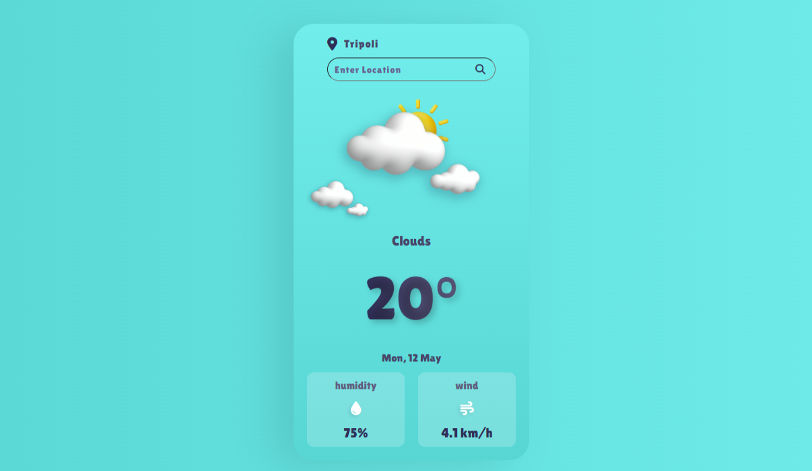
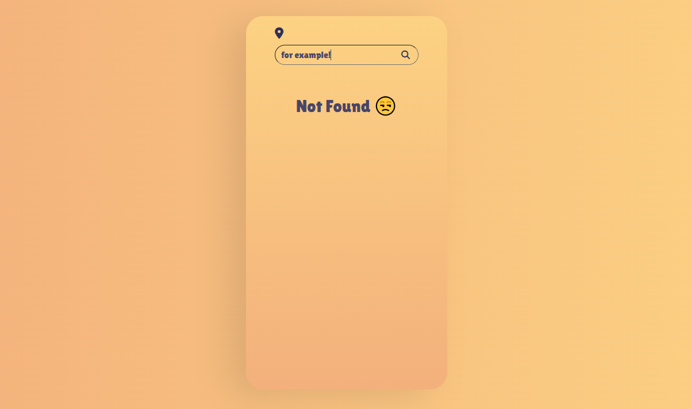

# 🌤️ Weather App

A clean, responsive weather app built with **React** and powered by the **OpenWeatherMap API**.  
It shows real-time weather conditions, including temperature, humidity, and wind speed, with friendly visuals and feedback.

## 📌 Features

- ✅ Default location is **Tripoli, Libya**
- 🌡️ Shows temperature, humidity, and wind speed
- 🎨 Weather-specific images (sunny, rainy, cloudy, snowy)
- ⏳ Loading animation while fetching data
- 😒 "Not Found" message if the location is invalid
- 📅 Displays the current date with day/month

## 🧠 About This Project

This weather app was built as part of my learning journey using React and working with APIs.  
I've studied from various online resources, tutorials, and documentation to complete it and gain hands-on experience with real-world features like API integration, dynamic UI updates, and user input handling.

## 🚀 Technologies Used

- [React](https://reactjs.org/)
- [Vite](https://vitejs.dev/)
- [OpenWeatherMap API](https://openweathermap.org/api)
- HTML / CSS / JavaScript

## 🖼️ Screenshots

### 🌤️ Default Weather Screen

### 😒 Not Found Example

## ⚙️ Getting Started

1. Clone the Repository:
   git clone https://github.com/YOUR_USERNAME/weather-app.git
   cd weather-app

2. Install Dependencies:
   npm install

3. Add Your API Key:
   Create a .env file in the root directory and add your API key from OpenWeatherMap:
   VITE_APP_API_KEY=your_api_key_here
   Make sure .env is listed in .gitignore so it's not pushed to GitHub.

4. Start the Development Server:
   npm run dev
   Then open http://localhost:5173 in your browser to see the app.
